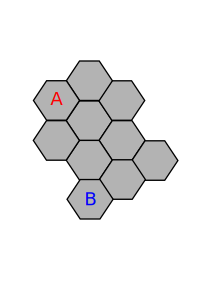

# Overview 

Up to three players on a board made of as tiles. Objective for each player is
to control every hexagon on the board or be the last player in the game.



## Board

A players goal is to either control the entire board, or enough of the board
that their opponent surrenders.

Boards are constructed out of hexagons called tiles. The properties of a tile
are listed below.

The way a player controls the board is by moving 'tokens' on to an adjoining
tile. A player controls a tile when they leave a minimum of one token on a
tile. 

Tiles on the board are contestable. Where an opponent owns an adjacent tile to
a neutral tile or a tile owned by another player, they may attempt to take
control of that adjacent tile. The number of tokens on a tile determines the
success of one player attempting to gain control of a tile. This is discussed
further in the 'Rules' section.

###  Tiles 

Tiles have the following properties:
  - have two states. Owned and neutral
  - hold _n_ number of tokens
  - must be adjacent to at least one other tile

### Starting state 

A board begins with every tile in the neutral state, except for the tile a
player starts on. 

## Rules

A tile that is adjacent to another tile can attack the adjoining tile.

## Win Conditions

# Development

> python3.8 -m venv venv
> . venv/bin/activate

Install the dependencies with `make install`. 

### Docker

Because none of the services images have been uploaded to a cloud hosted
registry you will need to build the dependency images yourself before being
able to run this service. Run `make build` in each of the following
repositories:

- player-api
- board-api
- combat-api

Now run `make up`. You may have to wait until the MySQL instance comes up
before the other containers will stay alive. To check whether the MySQL
database has finished coming up, run `docker logs risk-db` and look for text
similar to `ready for connections. Version: '8.0.20'  socket:
'/var/run/mysqld/mysqld.sock'  port: 3306  MySQL Community Server - GPL.`. Once
the MySQL container has finished coming up run `make up` again. You can check
that all expected containers are up by running `docker ps`.

### Important 

Remember to keep your local images up to date.

Soon images will be hosted so remembering to update images will no longer be an
issue.

## Database

To connect to the mysql database running in a the docker container run the
following command.


``` bash
mysql --host={HOST} --port={PORT} --protocol=TCP --user={USER} risk --password={PASSWORD}
```
 
# Using the API 


## `v0/board` | GET


Load the board state for a given board id


``` http
    /v0/board?id=1
```

### Response 

```json
    {
        "boardInfo": {
            "description": "My Great Board!",
            "created": "2020-07-25",
            "columns": 3,
            "rows": 3
            },
        "players": {
            }
        "tiles": [
            {},
            {}
            ]
    }
```

## `/v0/attack/` | PATCH


``` json
    {
        "attacker" : 
            {
                "hex_id": 1,
                "tokens": 12
            },
        "defender":
            {
                "hex_id: 2"
                "tokens": 10
            },
    }
```

### Responses

**Attack Completed**: Attacks can be completed but not always be successful.
Attacking with to few tokens results in a defeat. Attacking with enough tokens
results in taking over a tile.

**No Connection**: Trying to attack a destination tile that is not connected to
the source tile will return a __no connection__ response and no attack is
completed.
